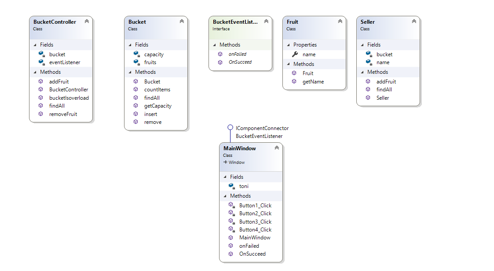

# Fresh Fruit
Freash Fruit merupakan sebuah aplikasi yang digunakan untuk menambahkan buah-buahan kedalam keranjang, serta menampilkan gambar/icon . Pada Aplikasi ini juga terdapat konsep MVC (Model View Controller).

## Scope & Functionalities
- User dapat menekan tombol Add untuk menambahkan buah/fruit
- User dapat menampilkan nama buah yang sudah di ADD kedalam keranjang (Listbox)

## How Does It Work?
Pada Method `Fruit.cs` itu merupakan Logic View yang digunakan untuk menampilkan nama buah pada listbox. berikut merupakan source codenya
```csharp
public string name { get; set; }

        public Fruit(string name)
        {
            this.name = name;
        }
        public string getName()
        {
            return this.name;
        }
```
Logic model bisnis pada `MainWindow.xaml.cs` digunakan untuk menambahkan buah dengan cara menekan tombol ADD pada setiap gambar , dan menampilkannya pada listbox melalui method `Fruit.cs` berikut merupakan source code pada `MainWindow.xaml.cs`
```csharp
private void OnButtonAddAnggurClicked(object sender, RoutedEventArgs e)
        {
            Fruit anggur = new Fruit("Anggur");
            farid.addFruit(anggur);

            ListBoxBucket.Items.Refresh();
        }

        private void OnButtonAddAppleClicked(object sender, RoutedEventArgs e)
        {
            Fruit apple = new Fruit("Apple");
            farid.addFruit(apple);

            ListBoxBucket.Items.Refresh();
        }

        private void OnButtonAddOrangeClicked(object sender, RoutedEventArgs e)
        {
            Fruit orange = new Fruit("Orange");
            farid.addFruit(orange);

            ListBoxBucket.Items.Refresh();
        }

        private void OnButtonAddBananaClicked(object sender, RoutedEventArgs e)
        {
            Fruit banana = new Fruit("Banana");
            farid.addFruit(banana);

            ListBoxBucket.Items.Refresh();

        }
```

## Fungsi `BucketEventListener.cs`
Fungsi class tersebut yaitu untuk membuat interface yang menampung method `OnSucceed` dan `OnFailed` yang memberikan message ketika berhasil maupun tidak berhasil ketika menambahkan item.

## Class Diagram


## Logika Pemrograman
Diawali dengan class `Bucket.cs` yang berfungsi untuk menampung buah dan kemudian class `Fruits.cs` untuk menampung jenis buah dan class `Seller.cs` digunakan untuk mengatur seller, kemudian terdapat pop up ketika berhasil atau tidak berhasil menambahkan buah diatur dalam class interface `BucketEventListener.cs` dan yang terakhir pada class `MainWindow.xaml.cs` yang mengatur dan menggabungkan keseluruhan antar Bucket, Fruit dan Seller dan yang mengatur banyak buah yang dapat ditambahkan.
